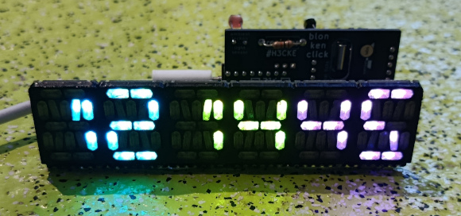
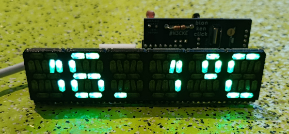
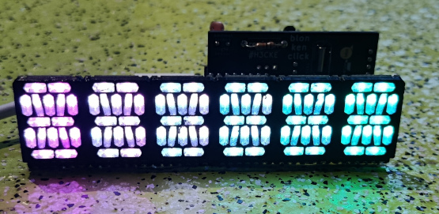
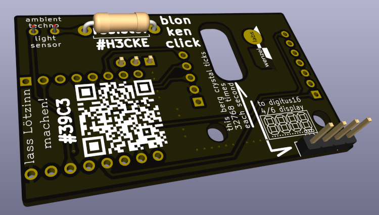
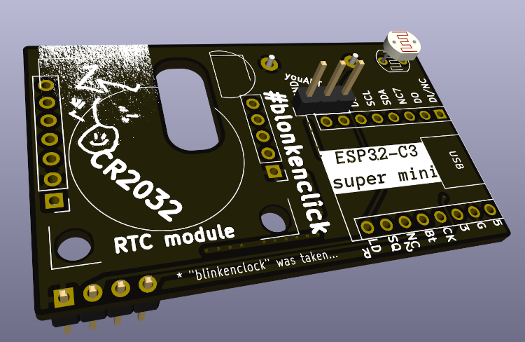
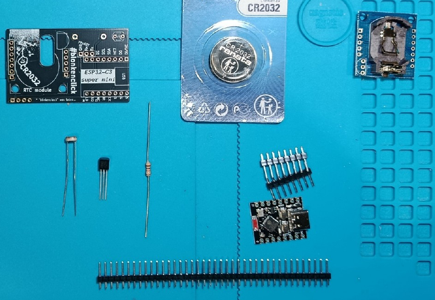

# blonkenclick

a blinken clock.

a beginner's solder kit with a fancy RGB 16 segment display (6 digits wide), a realtime clock, a temperature sensor around an ESP32 microprocessor running micropython.

As a display it uses our [digitus16](https://github.com/wenzellabs/digitus16) 16 segment display.

## Parts List

| quantity | symbol | description                 | notes               |
|----------|--------|-----------------------------|---------------------|
|    1     |   -    | PCB                         | the rectangular black blonkenclick PCB |
|    1     |  R1    | LDR                         | light dependent resistor, white ceramic, red wiggly lines |
|    1     |  R2    | 10 kOhm resistor            | we may want to reduce the val once we see a real 5528 |
|    1     |  U2    | RTC module                  | here your time is kept even when unplugged, running from the CR2032 |
|    1     |  U1    | ESP32 C3 super mini         | small processor board with red "C3" labelled antenna and USB-C |
|    1     |   -    | DS18B20 temp sens           | DS18B20 1-wire digital temperature sensor |
|    1     |   -    | digitus16 6 digits          | 6 digits 16-segment RGB display |
|    1     |   -    | CR2032 battery              | for the RTC module  |
| enough   |   -    | pins                        | for mounting all modules and the optional UART header |
|          |        |                             |                     |

# Hardware

## KiCAD schematic board design

you find the design in the [`hardware/`](hardware/) folder. there's also the schematic PDF.

## each pin explained

we want you to learn.

and in turn be creative with your new device.

so that some of your questions you might have get already answered here we describe each pin of the contraption. some are not even used or required for the blonkenclick, we'll still explain them anyway. of course you are free to be creative with your new hardware and modify by soldering more sensors or actors to it, or just change it through it's python software, or run C++ or Rust or Assembly on the device. the hardware comes with WiFi and BT capabilities, but those still lay unused in your blonkenclick.

oh, and there's a maybe useful 4kBytes 24C32 EEPROM on the RTC module at i2c 0x50. store all your encypted secrets here.

| Name    | Source | Sink  | Description/Usage |
| ------- | ------ | ----  | ----------- |
| USB-C   |  sun   | ESP32 | power supply from your PC, powerbank, or PSU. can also be used to upload new firmware or debug |
|   5     | USB-C  | ESP32, EEP, digitus16, DS1307 | main 5V power supply for most sub-components, from USB-C |
|   G     | GND    |      | most electronic circuits have one (lowest) reference voltage/potential called ground. this is it. |
|   3     | ESP32  | LDR voltage divider | for in/external use the ESP32 creates a 3.3V from the main 5V |
|   CK    | ESP32  | digitus16 | SPI clock, often called SCK or CO, here used to control the protocol with the addressable LEDs in digitus16 |
|  Bt     | CR2032 | ESP32 | to keep time without ext power, the RTC needs a battery, here the ESP can monitor the CR2032 bat voltage through one of its ADC channels |
|  NC2    | ESP32  | ESP32 | ESP32's GPIO2, not used in the design (NC=not connected), free for your hacks |
|  QS     | RTC    | ESP32 | the RTC can provide a 1Hz (or 4/8/32kHz) clock, currently unused in SW, but might be interesing for your low power design driven by a 1Hz ISR |
| LDR     | light dep voltage  | ESP32 | LDR5528's voltage divider tells us the ambient light situation through ADC0, we dim the display accordingly |
| Rx      | your PC | ESP32 | optional secondary serial terminal connection to anything, currently unused in SW, but has a nice optional pin header J1 |
| Tx      | ESP32 | your PC | optional secondary serial terminal connection to anything, currently unused in SW, but has a nice optional pin header J1 |
|  DS     | DS18B20 | ESP32 | 1-wire digital thermometer input pin from the DS18B20 sensor, following the onewire protocol |
|  SCL    | ESP32  | RTC/EEP | i2c clock, ESP32 is master |
|  SDA    | ESP32/RTC/EEP | ESP32/RTC/EEP | bidirectional i2c data, ESP32 is master, RTC at 0x68, EEPROM at 0x50 |
|  NC7    |        |       | ESP32's GPIO7, not used in the design (NC=not connected), free for your hacks |
|  DO     | ESP32  | digitus16 | SPI data, often called MOSI or DO, here used to talk the SPI protocol with the addressable LEDs in digitus16 |
|  DI/NC  | ESP32  | ESP32 | ESP32's GPIO5, not used in the design (NC=not connected), free for your hacks |
|         |        |       | |

## Assembly

there's the [assembly guide (english)](doc/en_assembly_guide_blonkenclick.pdf) in the [`doc/`](doc/) folder

TL;DR: assemble the PCB by going through the **Parts List** top to bottom.

## License

licensed under the **CERN Open Hardware Licence Version 2 - Strongly Reciprocal**
TBD

see [LICENSE.txt](LICENSE.txt) for details.

